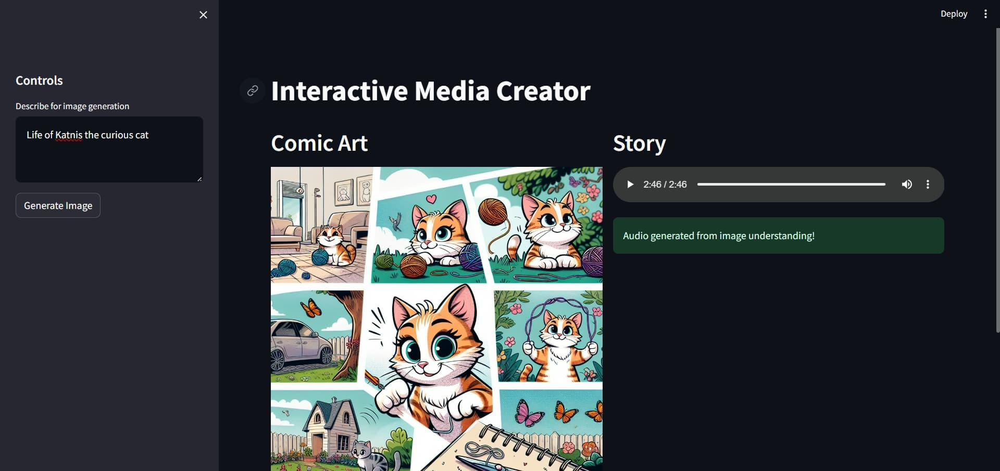

# Interactive Media App
[Tutorial Link](https://lablab.ai/t/crafting-engaging-stories-with-ai-building-an-interactive-media-app)

## Screenshots
### Main Page


### Generated Image and Story


## Instructions to run
```
python -m venv env
cd env\Scripts\activate 
pip install clarifai python-dotenv streamlit
streamlit run main.py
```